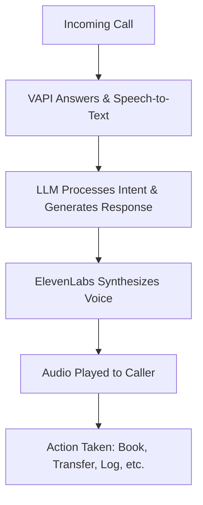

# AI Voice Agent Project

## Project Title
**AI Voice Agent for Automated Customer Service**  
*Powered by VAPI & ElevenLabs*

---

## Overview
Developed and deployed intelligent AI voice agents for two service-based industries — a car rental company and a dental clinic — to automate inbound calls, handle bookings, answer FAQs, and improve customer response times. This project leverages VAPI for voice infrastructure and ElevenLabs for high-quality text-to-speech synthesis, enabling natural, conversational interactions.

---

## Problem Statement
Both businesses faced common challenges:
- High volume of repetitive customer inquiries
- Missed calls during peak and after hours
- Long wait times leading to customer frustration
- Staff tied up answering routine questions instead of high-value tasks

---

## Solution
Built a conversational AI voice agent that:
- Answers calls 24/7 with natural-sounding speech
- Handles booking/rescheduling requests
- Responds to FAQs (pricing, availability, policies)
- Transfers complex queries to human agents when needed
- Logs call summaries and customer intent

---

## Tech Stack
| Component | Tool |
|-----------|------|
| Voice Infrastructure | VAPI |
| Text-to-Speech | ElevenLabs |
| LLM/Logic | OpenAI GPT-4 |
| Integration | Webhooks to booking system |

---

## Workflow

---

## Key Features by Industry

### Car Rental Service
- Vehicle availability checks
- Booking and reservation management
- Pricing and insurance inquiries
- Pickup/drop-off location info

### Dental Clinic
- Appointment scheduling & reminders
- Insurance and payment questions
- Service descriptions (cleanings, whitening, etc.)
- Emergency call triage

---

## Example Interaction (from ElevenLabs Dashboard)
Here's a real example from a test call in the car rental service agent, captured on November 20, 2023:

- **User**: Smith (inquiring about booking a drive tomorrow at 4pm)
- **Duration**: 0:10 seconds
- **Summary**: The user inquired about booking a drive tomorrow at 4pm. The agent explained the booking process and confirmed availability.
- **Transcript Overview**: (Full transcript available in dashboard) The agent used natural voice synthesis to guide the user through the process, ending with a successful booking request.
- **Metadata**:
  - Tool Cost: $0.00
  - Credits Used: 60 LLM, 0 TTS
  - Status: Successful

This demonstrates the agent's ability to handle quick, intent-based queries efficiently, with low latency and cost.

Example Conversation Screenshot  
*(Screenshot from ElevenLabs dashboard showing conversation history, waveform, summary, and metadata for a sample booking call.)*

---

## Results
- **80%** of routine calls handled without human intervention
- **24/7** availability without additional staffing costs
- **~30 sec** average call resolution time
- Improved customer satisfaction with instant responses

---

## Installation/Setup (for Demo)
1. Clone this repo: `git clone https://github.com/yourusername/ai-voice-agent.git`
2. Install dependencies: `npm install`
3. Set up API keys for VAPI, ElevenLabs, and OpenAI.
4. Run the agent: `node index.js`

For full code and deployment instructions, check the repo files.

---

## Learnings & Challenges
- Integrated ElevenLabs for realistic voice output, reducing uncanny valley effects.
- Optimized LLM prompts to handle industry-specific jargon (e.g., "dental fillings" or "rental mileage").
- Handled edge cases like poor audio quality or ambiguous intents via fallback transfers.

This project showcases scalable AI automation for customer service. Feel free to fork, contribute, or reach out for collaborations!

---

*Built by Segun Salako | Date: Dec 2025 | Open-source under MIT License*
